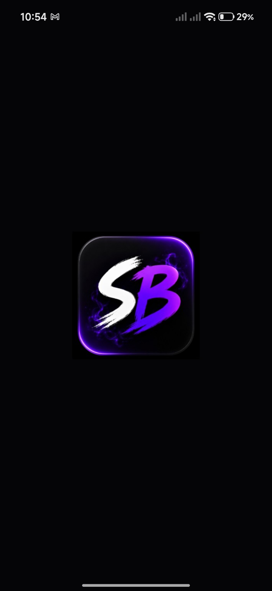
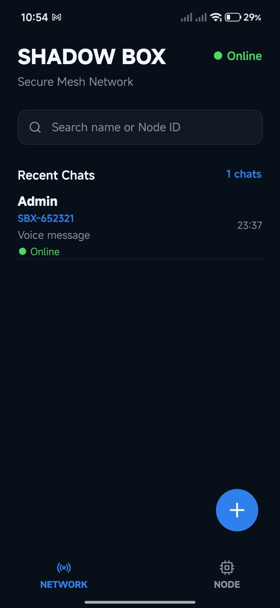
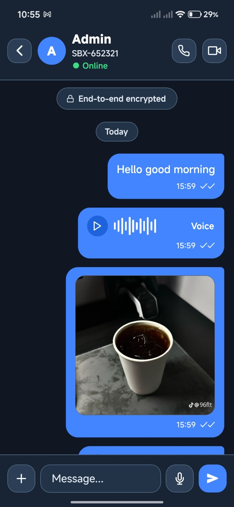
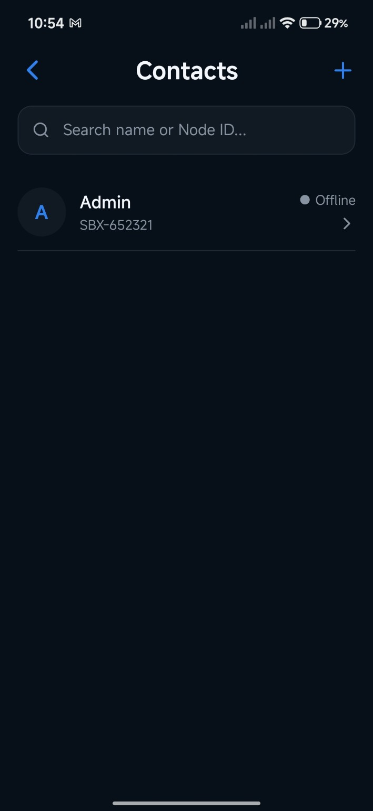
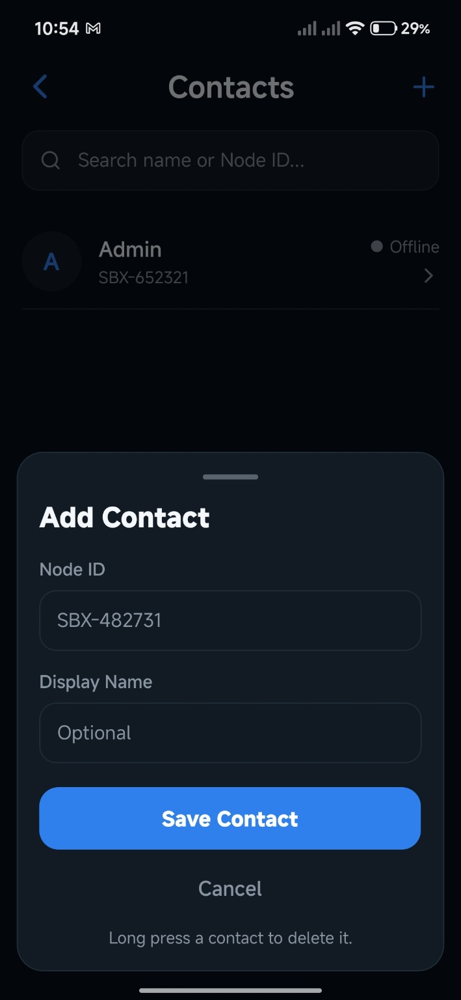
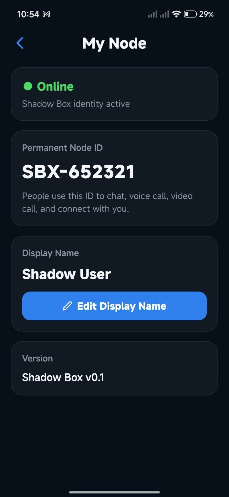

# Shadow Box

  

<h1 align="center">Shadow Box</h1>

Secure • Private • Reliable Communication

---

## Overview

Shadow Box is a secure communication platform built with modern technologies to provide fast, reliable, and privacy-focused messaging and calling.

The project is designed with a local-first architecture and aims to evolve into a resilient communication platform capable of operating across diverse networking environments while maintaining security, performance, and a great user experience.

---

# 👨‍💻 Founder

  

<h2 align="center">Simon Sunday</h2>

<b>Founder & Lead Developer of Shadow Box</b>

Passionate cybersecurity enthusiast and software developer focused on building secure, modern communication technologies.

Currently developing **Shadow Box** with an emphasis on privacy, reliability, performance, and scalable networking architecture.

### Areas of Interest

- 🔐 Cybersecurity
- 📱 Mobile Application Development
- 🌐 Networking & Distributed Systems
- ☁️ Backend Infrastructure
- 🤖 Artificial Intelligence
- 🚀 Secure Communication Technologies

> **"Building the future of secure communication—private, reliable, and designed for everyone."**

---

# Features

- 💬 One-to-one messaging
- 🎤 Voice notes
- 🖼️ Image sharing
- 📞 Voice calling
- 📹 Video calling
- 👥 Contact management
- 🆔 Permanent Shadow Node IDs
- 💾 SQLite local message storage
- ⚡ Fast and responsive interface
- 🔒 Privacy-focused architecture

---

# Technology Stack

- React Native
- JavaScript
- Node.js
- SQLite
- LiveKit
- Socket.IO
- Git & GitHub
- Linux

---

# Screenshots

## 🚀 Splash Screen

---

## 🏠 Home Screen

---

## 💬 Chat Screen

---

## 👥 Contacts

---

## ➕ Add Contact

---

## 🆔 My Node

---

# Project Status

🚧 **Active Development**

Shadow Box is under active development, with new features and improvements being added continuously.

---

## License

This project is licensed under the MIT License.