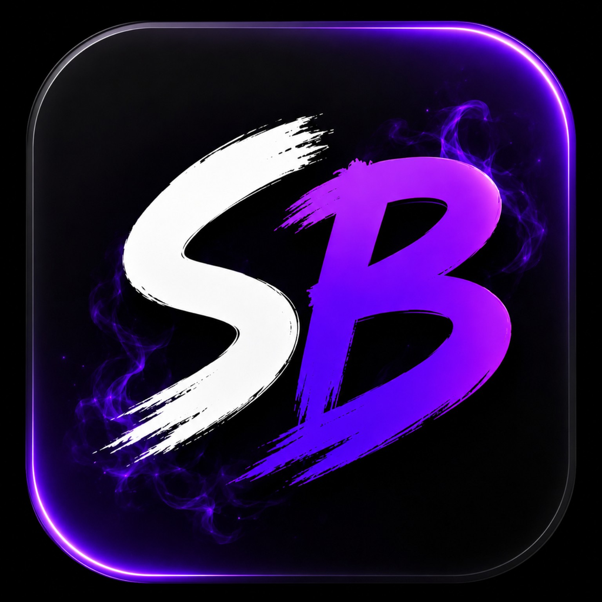

# Shadow Box

A secure communication platform built with **React Native**, **Node.js**, **SQLite**, and **LiveKit**.

## Overview

Shadow Box is a modern communication platform focused on secure messaging, real-time communication, and a clean user experience. It includes permanent Shadow Node IDs, local-first storage, voice notes, image sharing, and voice/video calling.

## Features

- 🔐 Secure messaging
- 🆔 Permanent Shadow Node IDs
- 💬 Real-time chat
- 🎤 Voice notes
- 🖼️ Image sharing
- 📞 Voice calls
- 📹 Video calls
- 👥 Contact management
- 💾 SQLite local database
- 🌐 Node.js backend
- 📡 LiveKit integration

## Screenshots

### Splash Screen

### Home Screen

### Chat

### Contacts

### Add Contact

### My Node

## Tech Stack

- React Native
- JavaScript
- Node.js
- SQLite
- LiveKit
- Git
- GitHub

## Project Status

🚧 Active development

## Author

**Simon Sunday**